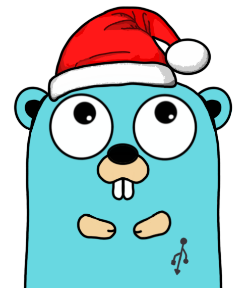

# advent-of-code-go

Resolving all [Advent of Code](https://adventofcode.com/) challenges in GO.

<div align="center">




</div>

### Prerequisites

Make sure you have Go >= 1.21.4.

### Clone the repository

```sh
git clone git@github.com:teodorpopa/advent-of-code-go.git
```

### Set the AoC cookie value

You can grab the cookie value logging in https://adventofcode.com/ and look at the application cookie named `session`

```sh
go run main.go credentials --cookie .......
```

### Scaffold files for a day

```sh
make scaffold year=2023 day=01
```

### View calendar

```sh
make calendar year=2023
```

### View puzzle .md

```sh
make view year=2023 day=01
```

### Compile and run

To run a solution, you need to provide some arguments.
* the `--year` flag must be set to specify the year of the challenge
* the `--day` flag must be set to specify which day's solution should run
* the `--part` flag specifies if you only want to run a specific part

make command:

```sh
make run year=2023 day=01
```

### Test the solutions

To test the solutions for a specific year/day, you need to run the following command:

```sh
make test year=2023 day=01
```